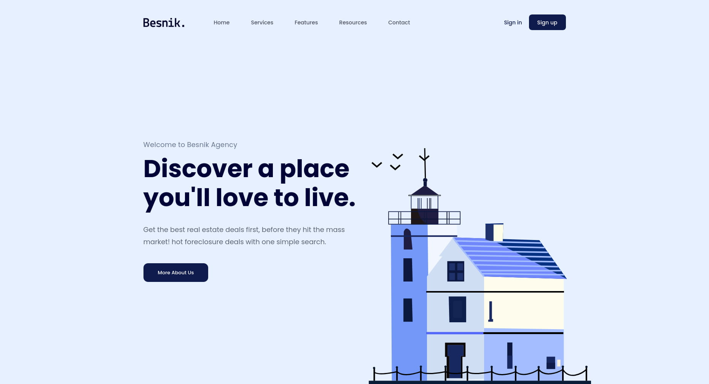

# 🏡 HTML CSS Project 01 - Besnik Agency

Responsive landing page using HTML5, SCSS, and BEM.

## 🚀 Live Demo
👉 [View Demo](https://hieutrinh200.github.io/f8-htmlcss-project-01/)

## 📸 Preview

## ✨ Features
- Responsive layout for desktop, tablet, and mobile
- Semantic HTML5 with SEO meta tags
- Organized SCSS structure using BEM methodology
- Google Fonts integration
- Prettier for consistent code formatting

## 🛠 Tech Stack
- **HTML5**
- **SCSS (Sass)**
- **BEM methodology**
- **Google Fonts**
- **Prettier**

## 📜 Credits
- **Design**: Provided by [F8 Fullstack HTML CSS Pro course](https://fullstack.edu.vn/).
- **Note**: For learning purposes only.
